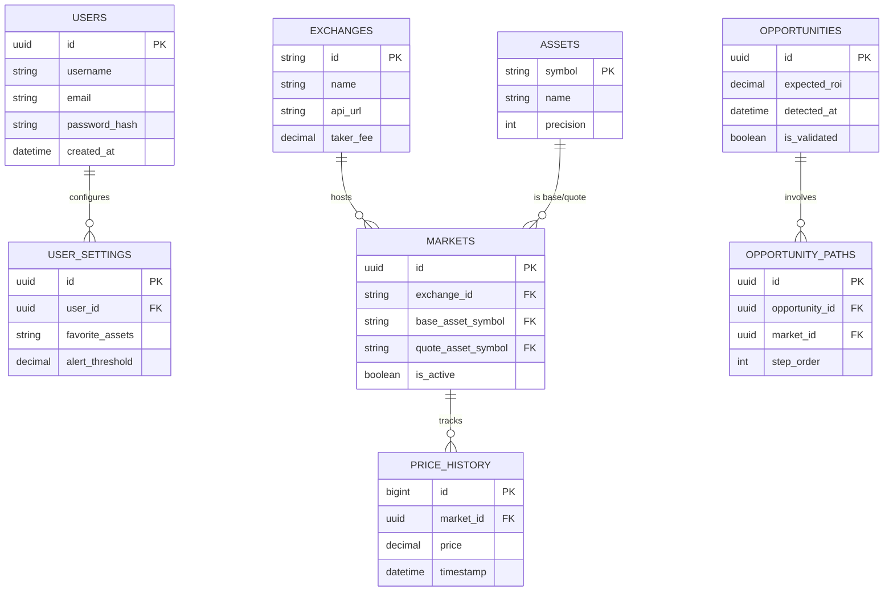

# Entity Relationship Diagram (ERD)

The database schema is designed to store structural market data and capture the results of the arbitrage detection engine for historical analysis.

## Diagram

## Table Descriptions
*   **USERS / USER_SETTINGS:** Stores researcher credentials and preferences (e.g., minimum ROI threshold for alerts).
*   **EXCHANGES:** Metadata about exchanges, including their standard trading fees used for profit calculation.
*   **ASSETS:** Master list of currencies/tokens supported by the system.
*   **MARKETS:** The junction between Assets and Exchanges (e.g., Binance-BTC-USDT).
*   **PRICE_HISTORY:** A time-series table for auditing and backtesting detection logic.
*   **OPPORTUNITIES:** Records every "negative cycle" found that passed the profitability filter.
*   **OPPORTUNITY_PATHS:** A normalized table representing the sequence of trades in a detected arbitrage loop (e.g., USD -> BTC -> ETH -> USD).

<!-- update: 2026-02-14T15:02:58 0 -->

<!-- update: 2026-02-14T19:03:21 1 -->

<!-- update: 2026-02-15T18:16:07 0 -->

<!-- update: 2026-02-15T20:41:34 1 -->

<!-- update: 2026-02-15T20:33:18 2 -->

<!-- update: 2026-02-16T09:01:36 0 -->

<!-- update: 2026-02-17T17:33:53 0 -->

<!-- update: 2026-02-17T18:00:38 1 -->

<!-- update: 2026-02-18T13:01:11 0 -->

<!-- update: 2026-02-18T10:23:28 1 -->

<!-- update: 2026-02-18T15:32:15 2 -->
