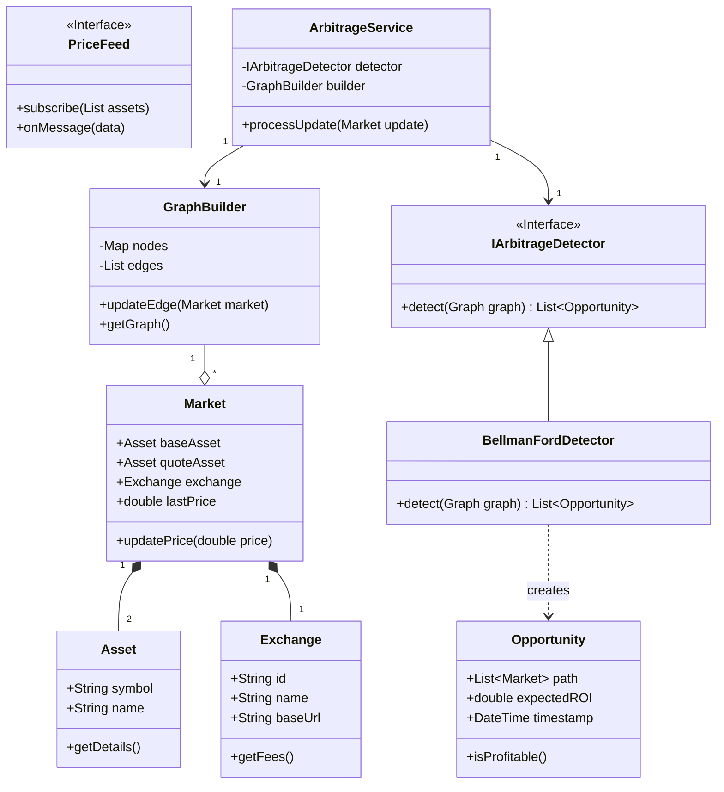

# Class Diagram

This diagram represents the core domain and service structure of the Arbitrage Detection Engine, following Clean Architecture principles.

## Diagram

## Description of Key Classes
*   **Asset & Exchange:** Core domain entities representing the entities involved in trading.
*   **Market:** Represents a specific trading pair on a specific exchange (e.g., BTC/USDT on Binance). This holds the weight for the graph edges.
*   **GraphBuilder:** Maintains the internal state of the adjacency list/matrix. It handles the mathematical transformation of prices into graph weights.
*   **IArbitrageDetector:** An interface for the detection logic, allowing for easy swapping of algorithms (e.g., Bellman-Ford vs. SPFA) without changing the service layer.
*   **ArbitrageService:** The orchestrator that receives data from the feed, tells the builder to update, and triggers the detector.
*   **Opportunity:** A data structure containing the detected path, the assets involved, and the calculated return on investment.
