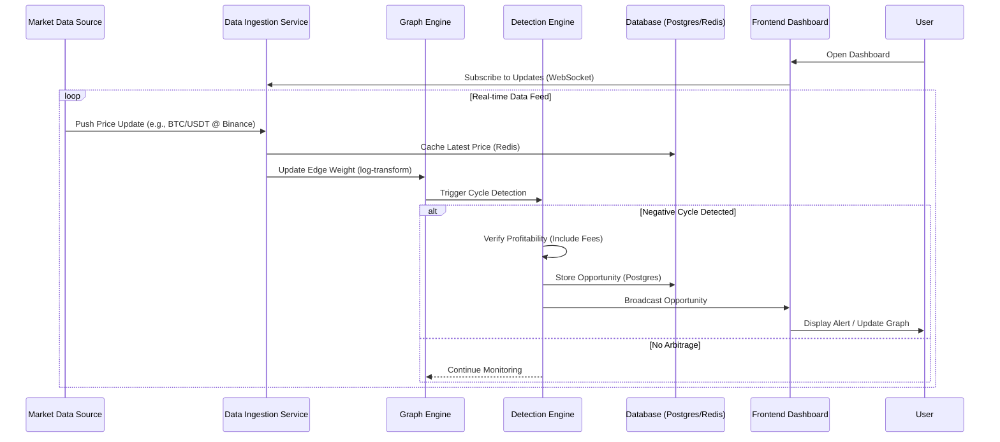

# Sequence Diagram - End-to-End Workflow

This diagram illustrates the flow of data from external market sources through the detection engine to the end user.

## Diagram

## Workflow Explanation
1.  **Subscription:** The User opens the frontend, which establishes a WebSocket connection to the backend for real-time updates.
2.  **Ingestion:** The `Data Ingestion Service` receives raw price updates from external sources.
3.  **Transformation:** Prices are cached in Redis for fast access. The `Graph Engine` updates the corresponding edge in the directed graph using a log-weighted transformation (-log(price)).
4.  **Detection:** Upon every significant edge update, the `Detection Engine` runs a negative cycle detection algorithm.
5.  **Validation:** If a cycle is found, the engine validates it against trading fees and liquidity constraints.
6.  **Persistence & Notification:** Profitable opportunities are saved to PostgreSQL for historical record and pushed immediately to the frontend via WebSockets.
