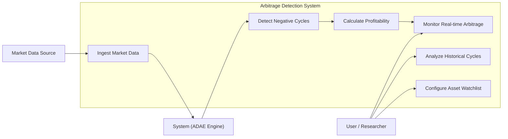

# Use Case Diagram

## Actors
*   **User / Researcher:** Interacts with the dashboard to view live data, analyze history, and configure the engine.
*   **System (ADAE Engine):** The automated backend responsible for processing data and detecting cycles.
*   **Market Data Source:** External APIs and WebSockets providing the raw price feeds.

## Diagram

## Relationships
*   **User -> UC1/UC2/UC3:** The user initiates monitoring, historical analysis, and configuration.
*   **DataSource -> UC4:** External providers push or allow polling of price data.
*   **UC4 -> System:** The ingested data is processed by the internal system.
*   **System -> UC5 -> UC6:** The engine detects cycles and then calculates if they are profitable after fees.
